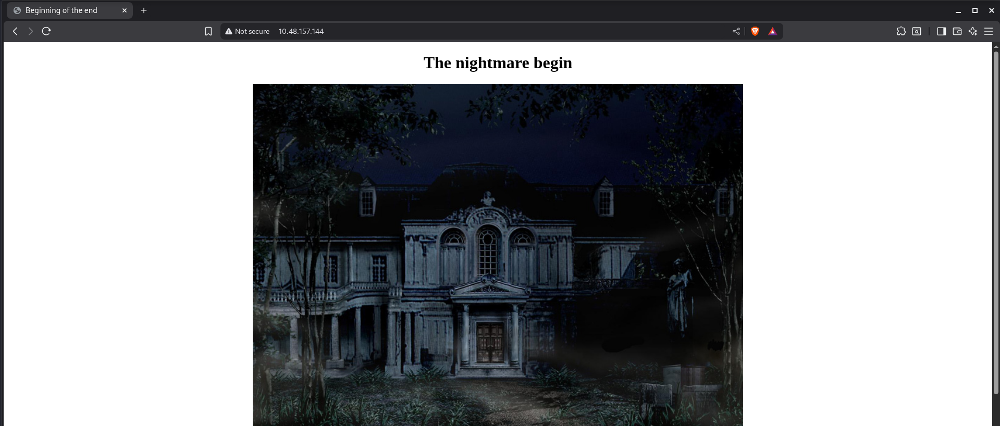

# Biohazard

## Port Scanning

```bash
┌──(ajay㉿ajay)-[~/tryhackme/medium/Biohazard]
└─$ rustscan -a 10.48.157.144 -- -A
.----. .-. .-. .----..---.  .----. .---.   .--.  .-. .-.
| {}  }| { } |{ {__ {_   _}{ {__  /  ___} / {} \ |  `| |
| .-. \| {_} |.-._} } | |  .-._} }\     }/  /\  \| |\  |
`-' `-'`-----'`----'  `-'  `----'  `---' `-'  `-'`-' `-'
The Modern Day Port Scanner.
________________________________________
: http://discord.skerritt.blog         :
: https://github.com/RustScan/RustScan :
 --------------------------------------
I don't always scan ports, but when I do, I prefer RustScan.

[~] The config file is expected to be at "/home/ajay/.rustscan.toml"
[!] File limit is lower than default batch size. Consider upping with --ulimit. May cause harm to sensitive servers
[!] Your file limit is very small, which negatively impacts RustScan's speed. Use the Docker image, or up the Ulimit with '--ulimit 5000'. 
Open 10.48.157.144:21
Open 10.48.157.144:22
Open 10.48.157.144:80
[~] Starting Script(s)
[>] Running script "nmap -vvv -p {{port}} {{ip}} -A" on ip 10.48.157.144
Depending on the complexity of the script, results may take some time to appear.
[~] Starting Nmap 7.95 ( https://nmap.org ) at 2025-11-30 08:51 CST
NSE: Loaded 157 scripts for scanning.
NSE: Script Pre-scanning.
NSE: Starting runlevel 1 (of 3) scan.
Initiating NSE at 08:51
Completed NSE at 08:51, 0.00s elapsed
NSE: Starting runlevel 2 (of 3) scan.
Initiating NSE at 08:51
Completed NSE at 08:51, 0.00s elapsed
NSE: Starting runlevel 3 (of 3) scan.
Initiating NSE at 08:51
Completed NSE at 08:51, 0.00s elapsed
Initiating Ping Scan at 08:51
Scanning 10.48.157.144 [4 ports]
Completed Ping Scan at 08:51, 0.08s elapsed (1 total hosts)
Initiating Parallel DNS resolution of 1 host. at 08:51
Completed Parallel DNS resolution of 1 host. at 08:51, 0.02s elapsed
DNS resolution of 1 IPs took 0.02s. Mode: Async [#: 1, OK: 0, NX: 1, DR: 0, SF: 0, TR: 1, CN: 0]
Initiating SYN Stealth Scan at 08:51
Scanning 10.48.157.144 [3 ports]
Discovered open port 80/tcp on 10.48.157.144
Discovered open port 22/tcp on 10.48.157.144
Discovered open port 21/tcp on 10.48.157.144
Completed SYN Stealth Scan at 08:51, 0.05s elapsed (3 total ports)
Initiating Service scan at 08:51
Scanning 3 services on 10.48.157.144
Completed Service scan at 08:51, 6.08s elapsed (3 services on 1 host)
Initiating OS detection (try #1) against 10.48.157.144
Retrying OS detection (try #2) against 10.48.157.144
Initiating Traceroute at 08:51
Completed Traceroute at 08:51, 3.01s elapsed
Initiating Parallel DNS resolution of 2 hosts. at 08:51
Completed Parallel DNS resolution of 2 hosts. at 08:51, 0.02s elapsed
DNS resolution of 2 IPs took 0.02s. Mode: Async [#: 1, OK: 0, NX: 2, DR: 0, SF: 0, TR: 2, CN: 0]
NSE: Script scanning 10.48.157.144.
NSE: Starting runlevel 1 (of 3) scan.
Initiating NSE at 08:51
Completed NSE at 08:51, 3.72s elapsed
NSE: Starting runlevel 2 (of 3) scan.
Initiating NSE at 08:51
Completed NSE at 08:51, 0.20s elapsed
NSE: Starting runlevel 3 (of 3) scan.
Initiating NSE at 08:51
Completed NSE at 08:51, 0.00s elapsed
Nmap scan report for 10.48.157.144
Host is up, received echo-reply ttl 62 (0.035s latency).
Scanned at 2025-11-30 08:51:06 CST for 18s

PORT   STATE SERVICE REASON         VERSION
21/tcp open  ftp     syn-ack ttl 62 vsftpd 3.0.3
22/tcp open  ssh     syn-ack ttl 62 OpenSSH 7.6p1 Ubuntu 4ubuntu0.3 (Ubuntu Linux; protocol 2.0)
| ssh-hostkey: 
|   2048 c9:03:aa:aa:ea:a9:f1:f4:09:79:c0:47:41:16:f1:9b (RSA)
| ssh-rsa AAAAB3NzaC1yc2EAAAADAQABAAABAQDM1/tmq8Lrur25evbyyI7/+nxDlhbVbMMiRfz5a0eI7Sq9yODJGCVNMPJGKOwtgA/BlPi7V3TKyYJVeH1QOzP8mPLVgfYom6ovelJiLiR6VrO4dqxx+G3ir+tj/OOSc4MpmdnqCvQKtAeJ4e5bbWakFihXyy14yi++oOzqp2VDlqMNN+d2k0uSAx1rDbngwP3UvRfE1E1TaSYhljnb9kvWRxBABhpdkUjbcRLwxBAQFBm9Vm+yQYPurC9YJ1BUlJzOFesYnbS27bG1vVCcuPQN3YjcljVCXBdd0qIvZdYlez4+mVUcJJh1iWl83sfgo+wZRmfHsedjdL1eWNrkt+ed
|   256 2e:1d:83:11:65:03:b4:78:e9:6d:94:d1:3b:db:f4:d6 (ECDSA)
| ecdsa-sha2-nistp256 AAAAE2VjZHNhLXNoYTItbmlzdHAyNTYAAAAIbmlzdHAyNTYAAABBBNy83txF27peDYxMhrPqfipXwZtBNY9H4fww7f2FRCkt09tEcp5f5BKhOE4cNo033XYpmaowy1r4qgFpIqKjf64=
|   256 91:3d:e4:4f:ab:aa:e2:9e:44:af:d3:57:86:70:bc:39 (ED25519)
|_ssh-ed25519 AAAAC3NzaC1lZDI1NTE5AAAAIMhTmk6F06eyLfM0j07nUcnqMqGdgOfFqsp3eLdbwwn0
80/tcp open  http    syn-ack ttl 62 Apache httpd 2.4.29 ((Ubuntu))
|_http-title: Beginning of the end
| http-methods: 
|_  Supported Methods: GET POST OPTIONS HEAD
|_http-server-header: Apache/2.4.29 (Ubuntu)
Warning: OSScan results may be unreliable because we could not find at least 1 open and 1 closed port
OS fingerprint not ideal because: Missing a closed TCP port so results incomplete
Aggressive OS guesses: Linux 4.4 (97%), Android 9 - 10 (Linux 4.9 - 4.14) (96%), Linux 3.2 - 4.14 (96%), Linux 4.15 (95%), Linux 4.15 - 5.19 (95%), Linux 3.10 - 3.13 (95%), Linux 2.6.32 - 3.10 (95%), Linux 3.10 - 4.11 (94%), DD-WRT (Linux 3.18) (93%), Linux 3.13 (93%)
No exact OS matches for host (test conditions non-ideal).
TCP/IP fingerprint:
SCAN(V=7.95%E=4%D=11/30%OT=21%CT=%CU=34011%PV=Y%DS=3%DC=T%G=N%TM=692C59EC%P=x86_64-pc-linux-gnu)
SEQ(SP=107%GCD=1%ISR=10C%TI=Z%CI=I%II=I%TS=A)
SEQ(SP=FF%GCD=1%ISR=103%TI=Z%CI=I%II=I%TS=A)
OPS(O1=M510ST11NW6%O2=M510ST11NW6%O3=M510NNT11NW6%O4=M510ST11NW6%O5=M510ST11NW6%O6=M510ST11)
WIN(W1=68DF%W2=68DF%W3=68DF%W4=68DF%W5=68DF%W6=68DF)
ECN(R=Y%DF=Y%T=40%W=6903%O=M510NNSNW6%CC=Y%Q=)
T1(R=Y%DF=Y%T=40%S=O%A=S+%F=AS%RD=0%Q=)
T2(R=N)
T3(R=N)
T4(R=Y%DF=Y%T=40%W=0%S=A%A=Z%F=R%O=%RD=0%Q=)
T5(R=Y%DF=Y%T=40%W=0%S=Z%A=S+%F=AR%O=%RD=0%Q=)
T6(R=Y%DF=Y%T=40%W=0%S=A%A=Z%F=R%O=%RD=0%Q=)
T7(R=Y%DF=Y%T=40%W=0%S=Z%A=S+%F=AR%O=%RD=0%Q=)
U1(R=Y%DF=N%T=40%IPL=164%UN=0%RIPL=G%RID=G%RIPCK=G%RUCK=G%RUD=G)
IE(R=Y%DFI=N%T=40%CD=S)

Uptime guess: 44.008 days (since Fri Oct 17 09:39:29 2025)
Network Distance: 3 hops
TCP Sequence Prediction: Difficulty=255 (Good luck!)
IP ID Sequence Generation: All zeros
Service Info: OSs: Unix, Linux; CPE: cpe:/o:linux:linux_kernel

TRACEROUTE (using port 80/tcp)
HOP RTT      ADDRESS
1   25.94 ms 192.168.128.1
2   ...
3   26.27 ms 10.48.157.144

NSE: Script Post-scanning.
NSE: Starting runlevel 1 (of 3) scan.
Initiating NSE at 08:51
Completed NSE at 08:51, 0.00s elapsed
NSE: Starting runlevel 2 (of 3) scan.
Initiating NSE at 08:51
Completed NSE at 08:51, 0.00s elapsed
NSE: Starting runlevel 3 (of 3) scan.
Initiating NSE at 08:51
Completed NSE at 08:51, 0.00s elapsed
Read data files from: /usr/share/nmap
OS and Service detection performed. Please report any incorrect results at https://nmap.org/submit/ .
Nmap done: 1 IP address (1 host up) scanned in 17.72 seconds
           Raw packets sent: 64 (4.412KB) | Rcvd: 43 (3.180KB)
```

## Web Enumeration




```bash
<!-- SG93IGFib3V0IHRoZSAvdGVhUm9vbS8= -->
┌──(ajay㉿ajay)-[~/tryhackme/medium/Biohazard]
└─$ echo 'SG93IGFib3V0IHRoZSAvdGVhUm9vbS8=' | base64 -d
How about the /teaRoom/   
```


```bash
Location:
/diningRoom/
/teaRoom/
/artRoom/
/barRoom/
/diningRoom2F/
/tigerStatusRoom/
/galleryRoom/
/studyRoom/
/armorRoom/
/attic/
```


```bash
moonlight somata
```


```bash
NV2XG2LDL5ZWQZLFOR5TGNRSMQ3TEZDFMFTDMNLGGVRGIYZWGNSGCZLDMU3GCMLGGY3TMZL5
┌──(ajay㉿ajay)-[~/tryhackme/medium/Biohazard]
└─$ echo 'NV2XG2LDL5ZWQZLFOR5TGNRSMQ3TEZDFMFTDMNLGGVRGIYZWGNSGCZLDMU3GCMLGGY3TMZL5'| base32 -d
music_sheet{362d72deaf65f5bdc63daece6a1f676e} 
```


```bash
crest 2:
GVFWK5KHK5WTGTCILE4DKY3DNN4GQQRTM5AVCTKE
Hint 1: Crest 2 has been encoded twice
Hint 2: Crest 2 contanis 18 letters
Note: You need to collect all 4 crests, combine and decode to reavel another path
The combination should be crest 1 + crest 2 + crest 3 + crest 4.
Also, the combination is a type of encoded base and you need to decode it

┌──(ajay㉿ajay)-[~/tryhackme/medium/Biohazard]
└─$ echo 'GVFWK5KHK5WTGTCILE4DKY3DNN4GQQRTM5AVCTKE' | base32 -d |base58 -d
h1bnRlciwgRlRQIHBh   
```


```bash
<!-- Lbh trg gur oyhr trz ol chfuvat gur fgnghf gb gur ybjre sybbe.
Gur trz vf ba gur qvavatEbbz svefg sybbe. Ivfvg fnccuver.ugzy -->

“You get the blue gem by pushing the status to the lower floor.
 The gem is on the diningRoom first floor. Visit sapphire.html”
```


```bash
blue_jewel{e1d457e96cac640f863ec7bc475d48aa}
```


```bash
crest 1:
S0pXRkVVS0pKQkxIVVdTWUpFM0VTUlk9
Hint 1: Crest 1 has been encoded twice
Hint 2: Crest 1 contanis 14 letters
Note: You need to collect all 4 crests, combine and decode to reavel another path
The combination should be crest 1 + crest 2 + crest 3 + crest 4. 
Also, the combination is a type of encoded base and you need to decode it

┌──(ajay㉿ajay)-[~/tryhackme/medium/Biohazard]
└─$ echo 'S0pXRkVVS0pKQkxIVVdTWUpFM0VTUlk9'|base64 -d |base32 -d          
RlRQIHVzZXI6IG   
```


```bash
klfvg ks r wimgnd biz mpuiui ulg fiemok tqod.
Xii jvmc tbkg ks tempgf tyi_hvgct_jljinf_kvc

there is a shield key inside the dining room
the html page is called the great shield key
```


```bash
crest 3:
MDAxMTAxMTAgMDAxMTAwMTEgMDAxMDAwMDAgMDAxMTAwMTEgMDAxMTAwMTEgMDAxMDAwMDAgMDAxMTAxMDAgMDExMDAxMDAgMDAxMDAwMDAgMDAxMTAwMTEgMDAxMTAxMTAgMDAxMDAwMDAgMDAxMTAxMDAgMDAxMTEwMDEgMDAxMDAwMDAgMDAxMTAxMDAgMDAxMTEwMDAgMDAxMDAwMDAgMDAxMTAxMTAgMDExMDAwMTEgMDAxMDAwMDAgMDAxMTAxMTEgMDAxMTAxMTAgMDAxMDAwMDAgMDAxMTAxMTAgMDAxMTAxMDAgMDAxMDAwMDAgMDAxMTAxMDEgMDAxMTAxMTAgMDAxMDAwMDAgMDAxMTAwMTEgMDAxMTEwMDEgMDAxMDAwMDAgMDAxMTAxMTAgMDExMDAwMDEgMDAxMDAwMDAgMDAxMTAxMDEgMDAxMTEwMDEgMDAxMDAwMDAgMDAxMTAxMDEgMDAxMTAxMTEgMDAxMDAwMDAgMDAxMTAwMTEgMDAxMTAxMDEgMDAxMDAwMDAgMDAxMTAwMTEgMDAxMTAwMDAgMDAxMDAwMDAgMDAxMTAxMDEgMDAxMTEwMDAgMDAxMDAwMDAgMDAxMTAwMTEgMDAxMTAwMTAgMDAxMDAwMDAgMDAxMTAxMTAgMDAxMTEwMDA=
Hint 1: Crest 3 has been encoded three times
Hint 2: Crest 3 contanis 19 letters
Note: You need to collect all 4 crests, combine and decode to reavel another path
The combination should be crest 1 + crest 2 + crest 3 + crest 4. 
Also, the combination is a type of encoded base and you need to decode it

c3M6IHlvdV9jYW50X2h
```


```bash
crest 4:
gSUERauVpvKzRpyPpuYz66JDmRTbJubaoArM6CAQsnVwte6zF9J4GGYyun3k5qM9ma4s
Hint 1: Crest 2 has been encoded twice
Hint 2: Crest 2 contanis 17 characters
Note: You need to collect all 4 crests, combine and decode to reavel another path
The combination should be crest 1 + crest 2 + crest 3 + crest 4. 
Also, the combination is a type of encoded base and you need to decode it

pZGVfZm9yZXZlcg==
```

```bash
┌──(ajay㉿ajay)-[~/tryhackme/medium/Biohazard]
└─$ echo 'RlRQIHVzZXI6IGh1bnRlciwgRlRQIHBhc3M6IHlvdV9jYW50X2hpZGVfZm9yZXZlcg=='|base64 -d
FTP user: hunter, FTP pass: you_cant_hide_forever 
```

## FTP

```bash
┌──(ajay㉿ajay)-[~/tryhackme/medium/Biohazard]
└─$ ftp hunter@10.48.157.144
Connected to 10.48.157.144.
220 (vsFTPd 3.0.3)
331 Please specify the password.
Password: 
230 Login successful.
Remote system type is UNIX.
Using binary mode to transfer files.
ftp> ls
229 Entering Extended Passive Mode (|||55876|)
150 Here comes the directory listing.
-rw-r--r--    1 0        0            7994 Sep 19  2019 001-key.jpg
-rw-r--r--    1 0        0            2210 Sep 19  2019 002-key.jpg
-rw-r--r--    1 0        0            2146 Sep 19  2019 003-key.jpg
-rw-r--r--    1 0        0             121 Sep 19  2019 helmet_key.txt.gpg
-rw-r--r--    1 0        0             170 Sep 20  2019 important.txt
226 Directory send OK.
ftp> get 001-key.jpg
local: 001-key.jpg remote: 001-key.jpg
229 Entering Extended Passive Mode (|||48324|)
150 Opening BINARY mode data connection for 001-key.jpg (7994 bytes).
100% |****************************************************************************************************************|  7994      158.82 MiB/s    00:00 ETA
226 Transfer complete.
7994 bytes received in 00:00 (253.58 KiB/s)
ftp> get 002-key.jpg
local: 002-key.jpg remote: 002-key.jpg
229 Entering Extended Passive Mode (|||11835|)
150 Opening BINARY mode data connection for 002-key.jpg (2210 bytes).
100% |****************************************************************************************************************|  2210        1.03 MiB/s    00:00 ETA
226 Transfer complete.
2210 bytes received in 00:00 (79.32 KiB/s)
ftp> get 003-key.jpg
local: 003-key.jpg remote: 003-key.jpg
229 Entering Extended Passive Mode (|||10587|)
150 Opening BINARY mode data connection for 003-key.jpg (2146 bytes).
100% |****************************************************************************************************************|  2146      936.41 KiB/s    00:00 ETA
226 Transfer complete.
2146 bytes received in 00:00 (7.08 KiB/s)
ftp> get helmet_key.txt.gpg
local: helmet_key.txt.gpg remote: helmet_key.txt.gpg
229 Entering Extended Passive Mode (|||10664|)
150 Opening BINARY mode data connection for helmet_key.txt.gpg (121 bytes).
100% |****************************************************************************************************************|   121      656.46 KiB/s    00:00 ETA
226 Transfer complete.
121 bytes received in 00:00 (4.67 KiB/s)
ftp> get important.txt
local: important.txt remote: important.txt
229 Entering Extended Passive Mode (|||45745|)
150 Opening BINARY mode data connection for important.txt (170 bytes).
100% |****************************************************************************************************************|   170      917.21 KiB/s    00:00 ETA
226 Transfer complete.
170 bytes received in 00:00 (6.96 KiB/s)
ftp> exit
221 Goodbye.

```

```bash
┌──(ajay㉿ajay)-[~/tryhackme/medium/Biohazard]
└─$ ls
001-key.jpg  002-key.jpg  003-key.jpg  helmet_key.txt.gpg  important.txt  nmap
                                                                                                                                                             
┌──(ajay㉿ajay)-[~/tryhackme/medium/Biohazard]
└─$ cat important.txt 
Jill,

I think the helmet key is inside the text file, but I have no clue on decrypting stuff. 
Also, I come across a /hidden_closet/ door but it was locked.

From,
Barry
                                                                                                                                                             
┌──(ajay㉿ajay)-[~/tryhackme/medium/Biohazard]
└─$ file helmet_key.txt.gpg 
helmet_key.txt.gpg: GPG symmetrically encrypted data (AES256 cipher)
                                                                                                                                                             
┌──(ajay㉿ajay)-[~/tryhackme/medium/Biohazard]
└─$ open 001-key.jpg 
```


```bash
┌──(ajay㉿ajay)-[~/tryhackme/medium/Biohazard]
└─$ steghide extract -sf 001-key.jpg 
Enter passphrase: 
wrote extracted data to "key-001.txt".
                                                                                                                                                             
┌──(ajay㉿ajay)-[~/tryhackme/medium/Biohazard]
└─$ steghide extract -sf 002-key.jpg 
Enter passphrase: 
steghide: could not extract any data with that passphrase!
                                                                                                                                                             
┌──(ajay㉿ajay)-[~/tryhackme/medium/Biohazard]
└─$ ls               
001-key.jpg  002-key.jpg  003-key.jpg  helmet_key.txt.gpg  important.txt  
key-001.txt  nmap
                                                                                                                                                             
┌──(ajay㉿ajay)-[~/tryhackme/medium/Biohazard]
└─$ cat key-001.txt  
cGxhbnQ0Ml9jYW
                                                                                                                                                             
┌──(ajay㉿ajay)-[~/tryhackme/medium/Biohazard]
└─$ steghide extract -sf 002-key.jpg
Enter passphrase: 
steghide: could not extract any data with that passphrase!

┌──(ajay㉿ajay)-[~/tryhackme/medium/Biohazard]
└─$ file 002-key.jpg 
002-key.jpg: JPEG image data, JFIF standard 1.01, aspect ratio, density 1x1, 
segment length 16, comment: "5fYmVfZGVzdHJveV9", progressive, precision 8, 100x80, 
components 3
┌──(ajay㉿ajay)-[~/tryhackme/medium/Biohazard]
└─$ file 003-key.jpg 
003-key.jpg: JPEG image data, JFIF standard 1.01, aspect ratio, density 1x1, 
segment length 16, comment: "Compressed by jpeg-recompress", progressive, precision 8, 
100x80, components 3

┌──(ajay㉿ajay)-[~/tryhackme/medium/Biohazard]
└─$ binwalk -e 003-key.jpg               

DECIMAL       HEXADECIMAL     DESCRIPTION
--------------------------------------------------------------------------------
1930          0x78A           Zip archive data, at least v2.0 to extract, uncompressed size: 14, name: key-003.txt

WARNING: One or more files failed to extract: either no utility was found or its unimplemented

                                                                                                                                                             
┌──(ajay㉿ajay)-[~/tryhackme/medium/Biohazard]
└─$ ls
001-key.jpg  002-key.jpg  003-key.jpg  _003-key.jpg.extracted  helmet_key.txt.gpg  important.txt  key-001.txt  nmap
                                                                                                                                                             
┌──(ajay㉿ajay)-[~/tryhackme/medium/Biohazard]
└─$ cd _003-key.jpg.extracted 
                                                                                                                                                             
┌──(ajay㉿ajay)-[~/tryhackme/medium/Biohazard/_003-key.jpg.extracted]
└─$ ls
78A.zip  key-003.txt
                                                                                                                                                             
┌──(ajay㉿ajay)-[~/tryhackme/medium/Biohazard/_003-key.jpg.extracted]
└─$ cat key-003.txt          
3aXRoX3Zqb2x0

┌──(ajay㉿ajay)-[~/tryhackme/medium/Biohazard]
└─$ echo 'cGxhbnQ0Ml9jYW5fYmVfZGVzdHJveV93aXRoX3Zqb2x0'|base64 -d
plant42_can_be_destroy_with_vjolt 

┌──(ajay㉿ajay)-[~/tryhackme/medium/Biohazard]
└─$ echo "plant42_can_be_destroy_with_vjolt" | gpg --batch --yes --passphrase-fd 0 --decrypt helmet_key.txt.gpg   
gpg: AES256.CFB encrypted data
gpg: encrypted with 1 passphrase
helmet_key{458493193501d2b94bbab2e727f8db4b}

```


```bash
wpbwbxr wpkzg pltwnhro, txrks_xfqsxrd_bvv_fy_rvmexa_ajk
albert weasker password: stars_members_are_my_guinea_pig
SSH password: T_virus_rules
```


```bash
┌──(ajay㉿ajay)-[~/tryhackme/medium/Biohazard]
└─$ ls
001-key.jpg  002-key.jpg  003-key.jpg  _003-key.jpg.extracted  doom.tar.gz  helmet_key.txt.gpg  important.txt  key-001.txt  nmap
                                                                                                                                                             
┌──(ajay㉿ajay)-[~/tryhackme/medium/Biohazard]
└─$ gzip -d doom.tar.gz                                                                                            
                                                                                                                                                             
┌──(ajay㉿ajay)-[~/tryhackme/medium/Biohazard]
└─$ ls
001-key.jpg  002-key.jpg  003-key.jpg  _003-key.jpg.extracted  doom.tar  helmet_key.txt.gpg  important.txt  key-001.txt  nmap
                                                                                                                                                             
┌──(ajay㉿ajay)-[~/tryhackme/medium/Biohazard]
└─$ tar -xvf doom.tar             
eagle_medal.txt
                                                                                                                                                             
┌──(ajay㉿ajay)-[~/tryhackme/medium/Biohazard]
└─$ ls
001-key.jpg  002-key.jpg  003-key.jpg  _003-key.jpg.extracted  doom.tar  eagle_medal.txt  helmet_key.txt.gpg  important.txt  key-001.txt  nmap
                                                                                                                                                             
┌──(ajay㉿ajay)-[~/tryhackme/medium/Biohazard]
└─$ cat eagle_medal.txt                        
SSH user: umbrella_guest

```

## SSH

```bash
┌──(ajay㉿ajay)-[~/tryhackme/medium/Biohazard]
└─$ ssh umbrella_guest@10.48.157.144
The authenticity of host '10.48.157.144 (10.48.157.144)' can't be established.
ED25519 key fingerprint is SHA256:dOQYq6o72K3z+Nn6HtAR4ZFXoEZklDafT3VuF728yWc.
This key is not known by any other names.
Are you sure you want to continue connecting (yes/no/[fingerprint])? yes
Warning: Permanently added '10.48.157.144' (ED25519) to the list of known hosts.
umbrella_guest@10.48.157.144's password: 
Welcome to Ubuntu 18.04 LTS (GNU/Linux 4.15.0-20-generic x86_64)

 * Documentation:  https://help.ubuntu.com
 * Management:     https://landscape.canonical.com
 * Support:        https://ubuntu.com/advantage

 * Canonical Livepatch is available for installation.
   - Reduce system reboots and improve kernel security. Activate at:
     https://ubuntu.com/livepatch

320 packages can be updated.
58 updates are security updates.

Failed to connect to https://changelogs.ubuntu.com/meta-release-lts. Check your Internet connection or proxy settings

Last login: Fri Sep 20 03:25:46 2019 from 127.0.0.1
umbrella_guest@umbrella_corp:~$ ls -la
total 64
drwxr-xr-x  8 umbrella_guest umbrella 4096 Sep 20  2019 .
drwxr-xr-x  5 root           root     4096 Sep 20  2019 ..
-rw-r--r--  1 umbrella_guest umbrella  220 Sep 19  2019 .bash_logout
-rw-r--r--  1 umbrella_guest umbrella 3771 Sep 19  2019 .bashrc
drwxrwxr-x  6 umbrella_guest umbrella 4096 Sep 20  2019 .cache
drwxr-xr-x 11 umbrella_guest umbrella 4096 Sep 19  2019 .config
-rw-r--r--  1 umbrella_guest umbrella   26 Sep 19  2019 .dmrc
drwx------  3 umbrella_guest umbrella 4096 Sep 19  2019 .gnupg
-rw-------  1 umbrella_guest umbrella  346 Sep 19  2019 .ICEauthority
drwxr-xr-x  2 umbrella_guest umbrella 4096 Sep 20  2019 .jailcell
drwxr-xr-x  3 umbrella_guest umbrella 4096 Sep 19  2019 .local
-rw-r--r--  1 umbrella_guest umbrella  807 Sep 19  2019 .profile
drwx------  2 umbrella_guest umbrella 4096 Sep 20  2019 .ssh
-rw-------  1 umbrella_guest umbrella  109 Sep 19  2019 .Xauthority
-rw-------  1 umbrella_guest umbrella 7546 Sep 19  2019 .xsession-errors
umbrella_guest@umbrella_corp:~$ cd .jailcell/
umbrella_guest@umbrella_corp:~/.jailcell$ ls
chris.txt
umbrella_guest@umbrella_corp:~/.jailcell$ cat chris.txt 
Jill: Chris, is that you?
Chris: Jill, you finally come. I was locked in the Jail cell for a while. It seem that weasker is behind all this.
Jil, What? Weasker? He is the traitor?
Chris: Yes, Jill. Unfortunately, he play us like a damn fiddle.
Jill: Let's get out of here first, I have contact brad for helicopter support.
Chris: Thanks Jill, here, take this MO Disk 2 with you. It look like the key to decipher something.
Jill: Alright, I will deal with him later.
Chris: see ya.

MO disk 2: albert 
umbrella_guest@umbrella_corp:~$ cd ..
umbrella_guest@umbrella_corp:/home$ ls
hunter  umbrella_guest  weasker
umbrella_guest@umbrella_corp:/home$ cd hunter
umbrella_guest@umbrella_corp:/home/hunter$ ls
FTP
umbrella_guest@umbrella_corp:/home/hunter$ cd ..
umbrella_guest@umbrella_corp:/home$ cd weasker/
umbrella_guest@umbrella_corp:/home/weasker$ ls
Desktop  weasker_note.txt
umbrella_guest@umbrella_corp:/home/weasker$ cat weasker_note.txt 
Weaker: Finally, you are here, Jill.
Jill: Weasker! stop it, You are destroying the  mankind.
Weasker: Destroying the mankind? How about creating a 'new' mankind. A world, only the strong can survive.
Jill: This is insane.
Weasker: Let me show you the ultimate lifeform, the Tyrant.

(Tyrant jump out and kill Weasker instantly)
(Jill able to stun the tyrant will a few powerful magnum round)

Alarm: Warning! warning! Self-detruct sequence has been activated. All personal, please evacuate immediately. (Repeat)
Jill: Poor bastard

umbrella_guest@umbrella_corp:/home/weasker$ cd Desktop/
umbrella_guest@umbrella_corp:/home/weasker/Desktop$ ls
umbrella_guest@umbrella_corp:/home/weasker/Desktop$ ls -la
total 8
drwxr-xr-x 2 weasker weasker 4096 Sep 19  2019 .
drwxr-xr-x 9 weasker weasker 4096 Sep 20  2019 ..
umbrella_guest@umbrella_corp:/home/weasker/Desktop$ cd ..
umbrella_guest@umbrella_corp:/home/weasker$ ls -la
total 80
drwxr-xr-x  9 weasker weasker 4096 Sep 20  2019 .
drwxr-xr-x  5 root    root    4096 Sep 20  2019 ..
-rw-------  1 weasker weasker   18 Sep 20  2019 .bash_history
-rw-r--r--  1 weasker weasker  220 Sep 18  2019 .bash_logout
-rw-r--r--  1 weasker weasker 3771 Sep 18  2019 .bashrc
drwxrwxr-x 10 weasker weasker 4096 Sep 20  2019 .cache
drwxr-xr-x 11 weasker weasker 4096 Sep 20  2019 .config
drwxr-xr-x  2 weasker weasker 4096 Sep 19  2019 Desktop
drwx------  3 weasker weasker 4096 Sep 19  2019 .gnupg
-rw-------  1 weasker weasker  346 Sep 20  2019 .ICEauthority
drwxr-xr-x  3 weasker weasker 4096 Sep 19  2019 .local
drwx------  5 weasker weasker 4096 Sep 19  2019 .mozilla
-rw-r--r--  1 weasker weasker  807 Sep 18  2019 .profile
drwx------  2 weasker weasker 4096 Sep 19  2019 .ssh
-rw-r--r--  1 weasker weasker    0 Sep 20  2019 .sudo_as_admin_successful
-rw-r--r--  1 root    root     534 Sep 20  2019 weasker_note.txt
-rw-------  1 weasker weasker  109 Sep 20  2019 .Xauthority
-rw-------  1 weasker weasker 5548 Sep 20  2019 .xsession-errors
-rw-------  1 weasker weasker 6749 Sep 20  2019 .xsession-errors.old
```

```bash
umbrella_guest@umbrella_corp:/home/weasker$ su weasker
Password: 
weasker@umbrella_corp:~$ id
uid=1000(weasker) gid=1000(weasker) groups=1000(weasker),4(adm),24(cdrom),27(sudo),30(dip),46(plugdev),118(lpadmin),126(sambashare)
weasker@umbrella_corp:~$ sudo -l
[sudo] password for weasker: 
Matching Defaults entries for weasker on umbrella_corp:
    env_reset, mail_badpass, secure_path=/usr/local/sbin\:/usr/local/bin\:/usr/sbin\:/usr/bin\:/sbin\:/bin\:/snap/bin

User weasker may run the following commands on umbrella_corp:
    (ALL : ALL) ALL
    weasker@umbrella_corp:~$ sudo cat /root/root.txt
In the state of emergency, Jill, Barry and Chris are reaching the helipad and awaiting for the helicopter support.

Suddenly, the Tyrant jump out from nowhere. After a tough fight, brad, throw a rocket launcher on the helipad. Without thinking twice, Jill pick up the launcher and fire at the Tyrant.

The Tyrant shredded into pieces and the Mansion was blowed. The survivor able to escape with the helicopter and prepare for their next fight.

The End

flag: 3c5794a00dc56c35f2bf096571edf3bf
```